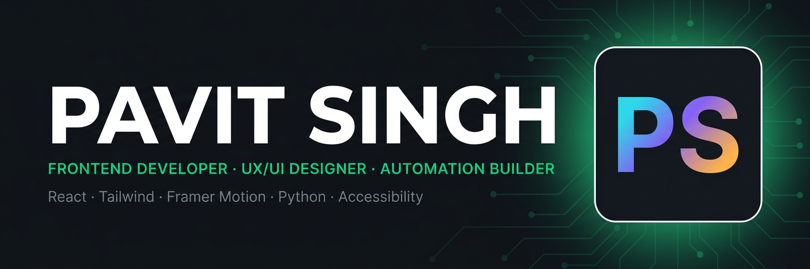

<div align="center">



<br/>

### Built by hand, measured by numbers. · *Craft over noise.*

I build fast, accessible, premium web experiences — and the small automation systems that make them easier to run.

<br/>

[](https://psdfolio1611.vercel.app/)
[](https://psdbcard.vercel.app/)
[](mailto:pavitsingh1611@gmail.com)
[](https://wa.me/919528923866)
[](https://instagram.com/pavitsingh1611)

</div>

---

## 👋 About me

```yaml
name:      Pavit Singh
brand:     PSDFOLIO · Pavit Systems
role:      Frontend Developer & UX/UI Designer · Automation Builder
location:  Saharanpur, Uttar Pradesh, India
exp:       4+ years coding (started at 10)
focus:     TypeScript · React · tests · accessibility
status:    accepting 1–2 new projects per month
```

- 🔭 Currently building **PSDFOLIO** — an audit-led portfolio OS with design tokens, motion and real performance budgets.
- 🌱 Currently learning **TypeScript**, deeper **React** patterns and automated **testing**.
- 🎯 I care about **WCAG 2.2 accessibility**, 44px tap targets, reduced-motion support and honest error states.
- 🤝 Open to collaborating on **frontend product work, design systems and automation tooling**.
- 💬 Ask me about **React, Tailwind, Framer Motion, Canvas animation, Python automation, web performance**.
- 📫 Reach me at **pavitsingh1611@gmail.com** or on [WhatsApp](https://wa.me/919528923866).

---

## 🛠️ Tech stack

**Core**


**Design & craft**


**Tooling & ship**


---

## 🚀 Featured projects

| Project | What it is | Links |
| :-- | :-- | :-- |
| **PSDFOLIO Portfolio OS** | Audit-led portfolio rebuild — design tokens, WebP art direction, ~82% mobile payload reduction. | [Live](https://psdfolio1611.vercel.app/) · [Code](https://github.com/pavit12301611/psdfolio1611) |
| **Webmers Marketplace** | Marketplace prototype: listings, checkout flow and an in-browser visual editor. | [Live](https://webmers.vercel.app/) · [Code](https://github.com/pavit12301611/webmers) |
| **Yarn Tales** | Handmade crochet e-commerce — teddy bears, accessories, WhatsApp ordering. | [Live](https://theyarntales.netlify.app/) · [Code](https://github.com/pavit12301611/theyarntales) |
| **Digital Business Card** | Personal digital card & brand hub with a downloadable vCard. | [Live](https://psdbcard.vercel.app/) |
| **Python Automation Toolkit** | Scripts that remove repetitive manual work. *Private — walkthrough on request.* | — |
| **Motion Prototype Lab** | Canvas + rAF experiments, frame-time readout, reduced-motion fallback. | *Demo on request* |
| **Developer Dashboard Concept** | Mobile-first dense dashboard — the phone layout loses zero features. | *Walkthrough on request* |

---

## 🧭 Journey

```text
2022 · First spark      →  First lines of HTML. Wanted to change a heading colour,
                           found view-source, rebuilt the page for a month.
2023 · Web frontier     →  Flexbox & Grid, first real multi-section site,
                           learned media queries the hard way on a friend's phone.
2024 · Logic & automation → JavaScript + Python scripts for repetitive work;
                           error handling learned by shipping, not tutorials.
2025 · Motion & craft   →  Canvas, motion, performance budgets — started measuring
                           everything after an effect tanked on a mid-range phone.
2026 · Now              →  Discipline over spectacle: auditing my own work,
                           case studies with real numbers, accessibility first.
```

---

## 📊 GitHub stats

<div align="center">


<br/>


</div>

---

## 🤝 Work with me

I take **1–2 new projects per month** — frontend builds, portfolio/product sites, design systems and automation.

<div align="center">

[](mailto:pavitsingh1611@gmail.com)
[](https://wa.me/919528923866)

<sub>© 2026 Pavit Singh · PSDFOLIO · Built by hand, measured by numbers.</sub>

</div>
