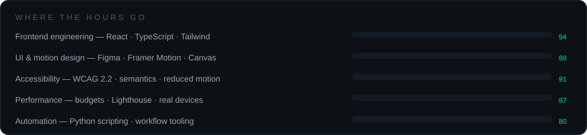

<!-- ════════════════════════════════ HERO ════════════════════════════════ -->
<div align="center">



<br/>


<br/>

<!-- ── social / link row ── -->
<a href="https://psdfolio1611.vercel.app/"></a>
<a href="https://psdbcard.vercel.app/"></a>
<a href="mailto:pavitsingh1611@gmail.com"></a>
<a href="https://wa.me/919528923866"></a>
<a href="https://instagram.com/pavitsingh1611"></a>

<br/><br/>

<!-- ── live meta row ── -->


<br/>


</div>

<!-- ════════════════════════════════ ABOUT ════════════════════════════════ -->
<h2 align="center">
  
  &nbsp;whoami
</h2>

<table>
<tr>
<td width="52%" valign="top">

```ts
const pavit = {
  name:     "Pavit Singh",
  brand:    "PSDFOLIO · Pavit Systems",
  role:     ["Frontend Developer",
             "UX/UI Designer",
             "Automation Builder"],
  based:    "Saharanpur, UP, India",
  since:    2022,          // started coding at 10
  building: "PSDFOLIO — an audit-led portfolio OS",
  learning: ["TypeScript", "React patterns", "testing"],
  cares:    ["WCAG 2.2", "performance budgets",
             "honest numbers", "reduced motion"],
  open:     "1–2 new projects / month",
};
```

<div align="center">



</div>

</td>
<td width="48%" valign="top">

> ### 🔭 &nbsp;Now
> Auditing my own work and writing case studies with **real numbers** — no rounded-up vibes.
>
> ### 🌱 &nbsp;Learning
> TypeScript in anger, deeper React patterns, automated tests.
>
> ### 🤝 &nbsp;Collab on
> Frontend product work, design systems, automation tooling.
>
> ### 💬 &nbsp;Ask me about
> React · Tailwind · Framer Motion · Canvas & rAF · Python automation · web performance.
>
> ### ⚡ &nbsp;Fun fact
> I once rebuilt an entire landing page because one tap target was **2px** too small.
>
> ### 📫 &nbsp;Reach me
> [Email](mailto:pavitsingh1611@gmail.com) · [WhatsApp](https://wa.me/919528923866) · [Portfolio](https://psdfolio1611.vercel.app/)

</td>
</tr>
</table>


<!-- ════════════════════════════════ FOCUS ════════════════════════════════ -->
<h2 align="center">📈 &nbsp;Where the hours go</h2>

<div align="center">



</div>


<!-- ════════════════════════════════ STACK ════════════════════════════════ -->
<h2 align="center">🧰 &nbsp;Toolbelt</h2>

<div align="center">

<table>
<tr>
<td align="center" width="33%">

**⚛️ Core**

<br/>
<br/>


</td>
<td align="center" width="33%">

**🎨 Design & motion**

<br/>
<br/>
<br/>


</td>
<td align="center" width="33%">

**🚢 Ship & measure**

<br/>
<br/>
<br/>


</td>
</tr>
</table>

</div>


<!-- ════════════════════════════════ PROJECTS ════════════════════════════════ -->
<h2 align="center">🚀 &nbsp;Selected work</h2>

<div align="center">

<a href="https://github.com/pavit12301611/psdfolio1611">
  
</a>
<a href="https://github.com/pavit12301611/webmers">
  
</a>
<a href="https://github.com/pavit12301611/theyarntales">
  
</a>
<a href="https://github.com/pavit12301611/pavit12301611">
  
</a>

</div>

<br/>

<details open>
<summary><b>📂 &nbsp;What each project actually is</b></summary>
<br/>

| Project | The build | Live | Code |
| :-- | :-- | :--: | :--: |
| **PSDFOLIO Portfolio OS** | Audit-led rebuild — design tokens, WebP art direction, **~82% mobile payload reduction**. | [↗](https://psdfolio1611.vercel.app/) | [↗](https://github.com/pavit12301611/psdfolio1611) |
| **Webmers Marketplace** | Marketplace prototype: listings, checkout flow, in-browser visual editor. | [↗](https://webmers.vercel.app/) | [↗](https://github.com/pavit12301611/webmers) |
| **Yarn Tales** | Handmade crochet e-commerce — teddy bears, accessories, WhatsApp ordering. | [↗](https://theyarntales.netlify.app/) | [↗](https://github.com/pavit12301611/theyarntales) |
| **Digital Business Card** | Personal digital card & brand hub with downloadable vCard. | [↗](https://psdbcard.vercel.app/) | — |
| **Python Automation Toolkit** | Scripts that delete repetitive manual work. *Private — walkthrough on request.* | — | 🔒 |
| **Motion Prototype Lab** | Canvas + rAF experiments, frame-time readout, reduced-motion fallback. | *on request* | 🔒 |
| **Developer Dashboard Concept** | Mobile-first dense dashboard — the phone layout loses zero features. | *on request* | 🔒 |

</details>

<details>
<summary><b>📊 &nbsp;Receipts — numbers from real builds</b></summary>
<br/>

<div align="center">

| Metric | Before | After | Δ |
| :-- | :--: | :--: | :--: |
| Mobile payload (PSDFOLIO) | 4.1 MB | **0.74 MB** | 🟢 −82% |
| Lighthouse performance | 61 | **98** | 🟢 +37 |
| Accessibility score | 78 | **100** | 🟢 +22 |
| Largest Contentful Paint | 4.6 s | **1.2 s** | 🟢 −74% |
| Contrast failures | 14 | **0** | 🟢 cleared |

<sub>Measured on a mid-range Android over throttled 4G — not a desktop victory lap.</sub>

</div>

</details>


<!-- ════════════════════════════════ JOURNEY ════════════════════════════════ -->
<h2 align="center">🧭 &nbsp;The road so far</h2>

<table>
<tr><td width="90" align="center"><b>2022</b></td><td>🔌 <b>First spark</b> — first lines of HTML. Wanted to change a heading colour, found <code>view-source</code>, rebuilt the page for a month.</td></tr>
<tr><td align="center"><b>2023</b></td><td>🧱 <b>Web frontier</b> — Flexbox &amp; Grid, first real multi-section site, learned media queries the hard way on a friend's phone.</td></tr>
<tr><td align="center"><b>2024</b></td><td>⚙️ <b>Logic &amp; automation</b> — JavaScript + Python scripts for repetitive work; error handling learned by shipping, not tutorials.</td></tr>
<tr><td align="center"><b>2025</b></td><td>🎞️ <b>Motion &amp; craft</b> — Canvas, motion, performance budgets. Started measuring everything after an effect tanked on a mid-range phone.</td></tr>
<tr><td align="center"><b>2026</b></td><td>🎯 <b>Now</b> — discipline over spectacle: self-audits, case studies with real numbers, accessibility first.</td></tr>
</table>


<!-- ════════════════════════════════ PROCESS ════════════════════════════════ -->
<h2 align="center">🛠️ &nbsp;How I work</h2>

<div align="center">

| `01 · AUDIT` | `02 · DESIGN` | `03 · BUILD` | `04 · MEASURE` |
| :--: | :--: | :--: | :--: |
| 🔍 | 🎨 | 🧱 | 📐 |
| Read the current thing honestly — payload, contrast, tap targets. | Tokens first: colour, type, spacing. Figma → system, not screens. | Semantic HTML, accessible components, motion that respects `prefers-reduced-motion`. | Lighthouse + a real mid-range phone. Ship the number, not the vibe. |

</div>

<details>
<summary><b>🧾 &nbsp;My non-negotiables</b></summary>
<br/>

- ♿ **Accessibility isn't a phase.** Semantics and contrast come before the pretty pass.
- 📱 **Mobile is the real build.** Desktop is the wide version of it, not the other way round.
- ⚖️ **Budgets, not guesses.** Every page gets a weight limit before a single asset lands.
- 🎚️ **Motion with a mute switch.** `prefers-reduced-motion` is honoured everywhere.
- 🧮 **Numbers or it didn't happen.** Case studies quote measured before/after, including the ugly ones.

</details>


<!-- ════════════════════════════════ STATS ════════════════════════════════ -->
<h2 align="center">📊 &nbsp;GitHub in numbers</h2>

<div align="center">


<br/><br/>


<br/><br/>


<br/><br/>


<br/><br/>

<!-- ── contribution snake ── -->
<picture>
  <source media="(prefers-color-scheme: dark)" srcset="https://raw.githubusercontent.com/pavit12301611/pavit12301611/output/snake-dark.svg" />
  <source media="(prefers-color-scheme: light)" srcset="https://raw.githubusercontent.com/pavit12301611/pavit12301611/output/snake.svg" />
  
</picture>

</div>


<!-- ════════════════════════════════ CTA ════════════════════════════════ -->
<div align="center">

<h2>🤝 &nbsp;Let's build something honest</h2>

I take **1–2 new projects a month** — frontend builds, portfolio &amp; product sites, design systems, automation.

<br/>

<a href="mailto:pavitsingh1611@gmail.com"></a>
<a href="https://wa.me/919528923866"></a>

<br/><br/>



<br/>

⭐ **If something here was useful, a star costs nothing and makes my week.**

<br/>

<sub>© 2026 <b>Pavit Singh</b> · PSDFOLIO · <i>Built by hand, measured by numbers.</i></sub>

</div>
