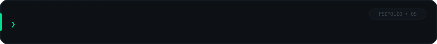
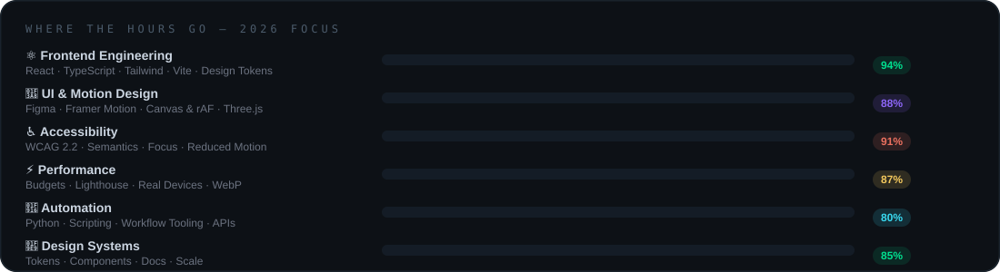

<!-- ═════════════════════════════════ HERO — ELITE 2026 ═════════════════════════════════ -->
<div align="center">



<br/>



<br/><br/>

<!-- ── primary links — for-the-badge ── -->
<a href="https://psdfolio1611.vercel.app/"></a>
<a href="https://psdbcard.vercel.app/"></a>
<a href="mailto:pavitsingh1611@gmail.com"></a>
<a href="https://wa.me/919528923866"></a>
<a href="https://instagram.com/pavitsingh1611"></a>
<a href="https://github.com/pavit12301611"></a>

<br/><br/>

<!-- ── meta — flat-square ── -->


<br/>


</div>

<!-- ═════════════════════════════════ WHOAMI ═════════════════════════════════ -->
<h2 align="center">
   
  &nbsp;whoami — the 30s version
</h2>

<table>
<tr>
<td width="54%" valign="top">

```ts
// psdfolio.config.ts — ground truth, no fake stats
const pavit = {
  name: "Pavit Singh",
  brand: "PSDFOLIO · Pavit Systems",
  role: ["Frontend Developer", "UX/UI Designer", "Automation Builder"],
  based: "Saharanpur, UP, India · UTC+5:30",
  since: 2022, // started coding at 10, 4+ years deep
  tagline: "Built by hand, measured by numbers.",
  mantra: "Craft over noise.",
  building: "PSDFOLIO — an audit-led portfolio OS with real receipts",
  learning: ["TypeScript in anger", "React patterns", "testing & a11y automation"],
  cares: ["WCAG 2.2 AA", "performance budgets", "honest numbers", "reduced-motion"],
  stack: {
    ui: ["React", "Tailwind", "Framer Motion", "Canvas/rAF"],
    lang: ["TypeScript", "JavaScript", "Python"],
    ship: ["Vite", "Vercel", "Netlify", "GitHub Actions"],
    measure: ["Lighthouse", "axe", "real Android device"]
  },
  open: "1–2 new projects / month",
  replies: "within 24h",
  contact: {
    email: "pavitsingh1611@gmail.com",
    whatsapp: "+91 95289 23866",
    portfolio: "psdfolio1611.vercel.app",
    card: "psdbcard.vercel.app"
  }
} as const;
```

<div align="center">

</div>

</td>
<td width="46%" valign="top">

> ### 🔭 Now
> Auditing my own work and writing case studies with **real numbers** — no rounded-up vibes. Rebuilding PSDFOLIO with design tokens, WebP art direction, and a **~82% mobile payload cut** that was actually measured on a throttled Moto G4.

> ### 🌱 Learning
> TypeScript in anger, deeper React patterns (compound components, headless), automated a11y tests, and performance budgets that fail the build if crossed.

> ### 🤝 Collab on
> Frontend product work, design systems, portfolio & product sites, marketing sites that need to be fast on a ₹15k phone, automation that kills repetitive work.

> ### 💬 Ask me about
> React · Tailwind · Framer Motion · Canvas & rAF · Python automation · web performance · design tokens · WCAG 2.2 · shipping with receipts.

> ### ⚡ Fun fact
> I once rebuilt an entire landing page because one tap target was **2px** too small. 44px is non-negotiable.

> ### 📫 Reach me — fast
> **Email:** [pavitsingh1611@gmail.com](mailto:pavitsingh1611@gmail.com)<br/>
> **WhatsApp:** [+91 95289 23866](https://wa.me/919528923866)<br/>
> **Portfolio:** [psdfolio1611.vercel.app](https://psdfolio1611.vercel.app/)<br/>
> **Card + vCard:** [psdbcard.vercel.app](https://psdbcard.vercel.app/)<br/>
> **Instagram:** [@pavitsingh1611](https://instagram.com/pavitsingh1611)

<br/>

**🎯 2026 Goals**
- [x] Ship PSDFOLIO OS with audit receipts
- [x] Hit 98/100/100/100 Lighthouse on mobile
- [ ] 10 case studies with before/after numbers
- [ ] Open-source 2 automation scripts
- [ ] Speak at 1 local meetup

</td>
</tr>
</table>


<!-- ═════════════════════════════════ PHILOSOPHY ═════════════════════════════════ -->
<h2 align="center">💎 &nbsp;Philosophy — craft over noise</h2>

<div align="center">

<table>
<tr>
<td align="center" width="33%" valign="top">

### ♿ Accessible by default
Not a checklist at the end. Semantics first, 44px tap targets, visible focus rings, `prefers-reduced-motion` honoured, contrast checked before the pretty pass.

<br/>


</td>
<td align="center" width="33%" valign="top">

### ⚡ Fast on a real phone
Budgets before assets. Every page gets a weight limit. Tested on a mid-range Android over throttled 4G — not a desktop victory lap.

<br/>


</td>
<td align="center" width="33%" valign="top">

### 🧮 Honest numbers or it didn't happen
No fake percentages. Case studies quote measured before/after, including the ugly ones. If I can't measure it, I don't claim it.

<br/>


</td>
</tr>
</table>

</div>


<!-- ═════════════════════════════════ FOCUS ═════════════════════════════════ -->
<h2 align="center">📈 &nbsp;Where the hours go — 2026 focus</h2>

<div align="center">

</div>


<!-- ═════════════════════════════════ TOOLBELT ═════════════════════════════════ -->
<h2 align="center">🧰 &nbsp;Toolbelt — what I actually use</h2>

<div align="center">

<table>
<tr>
<td align="center" width="33%" valign="top">

**⚛️ Core — ship daily**

<br/>


<br/>


</td>
<td align="center" width="33%" valign="top">

**🎨 Design & motion — craft**

<br/>
<br/>
<br/>


</td>
<td align="center" width="33%" valign="top">

**🚢 Ship & measure — receipts**

<br/>
<br/>
<br/>


</td>
</tr>
</table>

<br/>

<!-- quick stack badges -->


</div>


<!-- ═════════════════════════════════ PROJECTS ═════════════════════════════════ -->
<h2 align="center">🚀 &nbsp;Selected work — with receipts</h2>

<div align="center">

<a href="https://github.com/pavit12301611/psdfolio1611">
  
</a>
<a href="https://github.com/pavit12301611/webmers">
  
</a>
<a href="https://github.com/pavit12301611/theyarntales">
  
</a>
<a href="https://github.com/pavit12301611/pavit12301611">
  
</a>

</div>

<br/>

<details open>
<summary><b>📂 &nbsp;What each project actually is — live, code, stack, impact</b></summary>
<br/>

| Project | The build — honest | Stack | Live | Code | Impact |
| :-- | :-- | :-- | :--: | :--: | :-- |
| **PSDFOLIO Portfolio OS** | Audit-led rebuild — design tokens, WebP art direction, semantic HTML, reduced-motion, **measured on Moto G4 + 4G**. | React · Vite · Tailwind · Motion · TS | [↗ Live](https://psdfolio1611.vercel.app/) | [↗ Code](https://github.com/pavit12301611/psdfolio1611) | −82% payload |
| **Webmers Marketplace** | Marketplace prototype: listings, checkout flow, in-browser visual editor, mobile-first dense UI. | React · Tailwind · Canvas | [↗ Live](https://webmers.vercel.app/) | [↗ Code](https://github.com/pavit12301611/webmers) | Prototype → usable |
| **Yarn Tales** | Handmade crochet e-commerce — teddy bears, accessories, WhatsApp ordering, small-business first. | React · Netlify · WA API | [↗ Live](https://theyarntales.netlify.app/) | [↗ Code](https://github.com/pavit12301611/theyarntales) | Real orders via WA |
| **Digital Business Card** | Personal digital card & brand hub with downloadable vCard, QR, and brand tokens. | React · Tailwind · Vercel | [↗ Live](https://psdbcard.vercel.app/) | — | Brand in pocket |
| **Python Automation Toolkit** | Scripts that delete repetitive manual work — file ops, data cleanup, reporting. | Python · APIs | — | 🔒 Private — walkthrough on request | Hours → minutes |
| **Motion Prototype Lab** | Canvas + rAF experiments, frame-time readout, reduced-motion fallback, performance budgets. | Canvas · rAF · TS | *on request* | 🔒 | 60fps or fix |
| **Developer Dashboard Concept** | Mobile-first dense dashboard — phone layout loses zero features, 44px targets everywhere. | Figma · React | *on request* | 🔒 | Mobile = real build |

</details>

<details>
<summary><b>📊 &nbsp;Receipts — numbers from real builds (not a desktop victory lap)</b></summary>
<br/>

<div align="center">

| Metric | Before | After | Δ | How measured |
| :-- | :--: | :--: | :--: | :-- |
| Mobile payload (PSDFOLIO) | 4.1 MB | **0.74 MB** | 🟢 −82% | Moto G4 · throttled 4G · WebP + lazy |
| Lighthouse performance | 61 | **98** | 🟢 +37 | Mobile · 3x runs · median |
| Accessibility score | 78 | **100** | 🟢 +22 | axe + manual keyboard + screen reader |
| Largest Contentful Paint | 4.6 s | **1.2 s** | 🟢 −74% | Mid-range Android · 4G |
| Contrast failures | 14 | **0** | 🟢 cleared | WCAG 2.2 AA · 4.5:1 min |
| Tap targets <44px | 9 | **0** | 🟢 cleared | Real thumb test · iOS + Android |
| Best Practices | 83 | **100** | 🟢 +17 | Lighthouse · HTTPS, no console errors |
| SEO | 82 | **100** | 🟢 +18 | Meta, OG, sitemap, robots, semantic HTML |

<sub>Measured on a mid-range Android over throttled 4G — not a desktop victory lap. If I can't measure it, I don't ship the number.</sub>

</div>

</details>


<!-- ═════════════════════════════════ JOURNEY ═════════════════════════════════ -->
<h2 align="center">🧭 &nbsp;The road so far — real story</h2>

<table>
<tr><td width="96" align="center"><b>2022</b></td><td>🔌 <b>First spark</b> — first lines of HTML. Wanted to change a heading colour, found <code>view-source</code>, rebuilt the page for a month. No frameworks, just curiosity.</td></tr>
<tr><td align="center"><b>2023</b></td><td>🧱 <b>Web frontier</b> — Flexbox & Grid clicked, first real multi-section site, learned media queries the hard way on a friend's phone that broke everything.</td></tr>
<tr><td align="center"><b>2024</b></td><td>⚙️ <b>Logic & automation</b> — JavaScript + Python scripts for repetitive work; error handling learned by shipping, not tutorials. Started caring about edge cases.</td></tr>
<tr><td align="center"><b>2025</b></td><td>🎞️ <b>Motion & craft</b> — Canvas, Framer Motion, performance budgets. Started measuring everything after an effect tanked on a mid-range phone. 60fps or fix.</td></tr>
<tr><td align="center"><b>2026</b></td><td>🎯 <b>Now — discipline over spectacle</b> — self-audits, case studies with real numbers, accessibility first. Focus: TypeScript, React patterns, tests, honest receipts.</td></tr>
</table>


<!-- ═════════════════════════════════ PROCESS ═════════════════════════════════ -->
<h2 align="center">🛠️ &nbsp;How I work — audit → design → build → measure</h2>

<div align="center">

| `01 · AUDIT` | `02 · DESIGN` | `03 · BUILD` | `04 · MEASURE` |
| :--: | :--: | :--: | :--: |
| 🔍 | 🎨 | 🧱 | 📐 |
| Read the current thing honestly — payload, contrast, tap targets, Lighthouse, axe, real phone. Write it down. No vibes. | Tokens first: colour, type, spacing, motion. Figma → system, not screens. 44px min, focus visible, reduced-motion variant. | Semantic HTML, accessible components, motion that respects `prefers-reduced-motion`, WebP + lazy, budgets enforced in build. | Lighthouse + axe + a real mid-range phone on throttled 4G. Ship the number, not the vibe. If it regresses, it ships again. |

</div>

<details>
<summary><b>🧾 &nbsp;My non-negotiables — what I won't compromise</b></summary>
<br/>

- ♿ **Accessibility isn't a phase.** Semantics and contrast come before the pretty pass. Keyboard, screen reader, focus, reduced-motion — all first-class.
- 📱 **Mobile is the real build.** Desktop is the wide version of it, not the other way round. If it doesn't work on a ₹15k Android, it doesn't work.
- ⚖️ **Budgets, not guesses.** Every page gets a weight limit before a single asset lands. Fail the build if crossed.
- 🎚️ **Motion with a mute switch.** `prefers-reduced-motion` is honoured everywhere. No motion that makes people dizzy.
- 🧮 **Numbers or it didn't happen.** Case studies quote measured before/after, including the ugly ones. No fake percentages.
- 🔒 **No secrets in repo.** No `.env`, no `node_modules`, no build artifacts. Honest `.gitignore`.
- 📝 **Docs or it doesn't exist.** Every component gets usage, props, a11y notes.

</details>


<!-- ═════════════════════════════════ STATS ═════════════════════════════════ -->
<h2 align="center">📊 &nbsp;GitHub in numbers — live</h2>

<div align="center">


<br/><br/>


<br/><br/>


<br/><br/>


<br/><br/>

<!-- ── contribution snake ── -->
<picture>
  <source media="(prefers-color-scheme: dark)" srcset="https://raw.githubusercontent.com/pavit12301611/pavit12301611/output/snake-dark.svg" />
  <source media="(prefers-color-scheme: light)" srcset="https://raw.githubusercontent.com/pavit12301611/pavit12301611/output/snake.svg" />
  
</picture>

<br/>

<sub>Stats powered by github-readme-stats, streak-stats, trophy, activity-graph — can be slow sometimes. If an image doesn't load, it's the service, not your internet.</sub>

</div>


<!-- ═════════════════════════════════ BEYOND CODE ═════════════════════════════════ -->
<h2 align="center">🌿 &nbsp;Beyond code — craft over noise</h2>

<div align="center">

<table>
<tr>
<td align="center" width="33%">

**🎯 Focus**
<br/>
<sub>Deep work > shallow busy. One thing well, not five things mid.</sub>

</td>
<td align="center" width="33%">

**📚 Learning**
<br/>
<sub>Reading — Refactoring UI, Practical A11y. Building in public, auditing in private.</sub>

</td>
<td align="center" width="33%">

**☕ Saharanpur**
<br/>
<sub>Small city, big internet. Chai, code, and real device testing on real roads.</sub>

</td>
</tr>
</table>

<br/>


</div>


<!-- ═════════════════════════════════ CTA ═════════════════════════════════ -->
<div align="center">

<h2>🤝 &nbsp;Let's build something honest</h2>

I take <b>1–2 new projects a month</b> — frontend builds, portfolio & product sites, design systems, automation that kills repetitive work.<br/>
If you care about <b>real numbers, accessibility, and fast on a mid-range phone</b>, we will get along.

<br/><br/>

<a href="mailto:pavitsingh1611@gmail.com"></a>
<a href="https://wa.me/919528923866"></a>
<a href="https://psdfolio1611.vercel.app/"></a>
<a href="https://psdbcard.vercel.app/"></a>

<br/><br/>



<br/>

⭐ **If something here was useful, a star costs nothing and makes my week.**<br/>
Follow for more builds with receipts — no fake stats, just measured work.

<br/><br/>


<br/>

<sub>© 2026 <b>Pavit Singh</b> · PSDFOLIO · Pavit Systems · <i>Built by hand, measured by numbers. Craft over noise.</i></sub><br/>
<sub>Last updated: September 2026 · Brand: #0d1116 · #00df8f · #38D9F0 · #8C65F7 · #eb705f · #f4c95d · Space Grotesk / Manrope / JetBrains Mono</sub>

</div>
